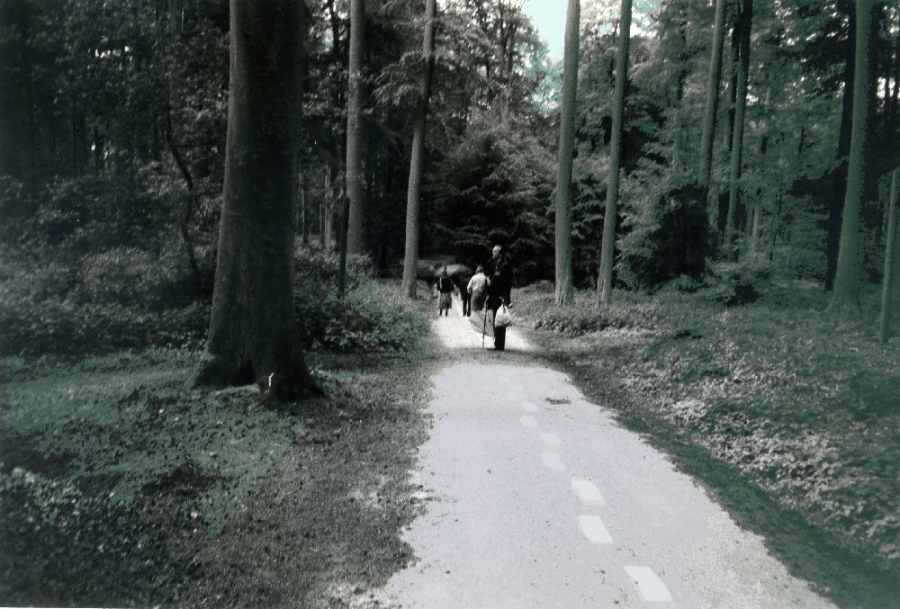

**Patacycliste org archives (by DK)**  *inclu.* [Laboratoires Patacyclistes](../01.dkorg-lp) 1992-1999 / [Pistologie](../02.dkorg-pist/) 1994-2017 / [Bureau du Port](../03.dkorg-bdp) 2000-2007 and [Fumoir](../04.dkorg-fum) 2008-2012  

NO RECLAME AUB SVP LP13 1995  
<small>**Laboratoires Patacyclistes** (1992-1999) Unidentified Meetings by DK incl. E.V.A. malibran (QG) Brussels, Duquesnoy, Ostende, Pistologie, Berlin, ...</small>  

#### chronologi:

**1992**  
LP01 rue Duquesnoystraat,8 - Brussel  
**1993**  
LP02 "Werken uit verveling" - Patrice Verhofstadt - Brussel  
LP03 [Jef Lambrecht "Le peintre des portes porte plainte" - Brussel](../lp03_peintre_de_portes)    
LP04 Jean-Luc Paquet – Brussel  
LP05 Michèle Barley - Brussel  
**1994**  
LP06 ["Les Grands Brulés" - Oostende](../lp06_grands_brul%C3%A9s)  
LP07 Rossignol, Nightingale - E.V.A. Malibran - Brussel  
LP08 Somer Universita - E.V.A. Malibran - Brussel  
LP08 1/2 Les aventures de Nanouche, Lombardie (Bxl) - Brussel  
LP09 Oorlogsrecepten - E.V.A. Malibran - Brussel  
**1995**  
LP10 Meringue - Oostende  
LP11 Grande Parade - Magasin 4 - Brussel  
LP12 La Générale Songfestival - E.V.A. Malibran - Brussel  
LP13 Streetspraakjes - E.V.A. Malibran - Brussel  
**1996**  
LP14 [Fermé- Gesloten 24H/24U - E.V.A. Malibran](../lp14_ferm%C3%A9_gesloten)   
LP15 "R" - Oostende  

   
Marc Rossignol "Promenade Rossignol" LP16 1996  
    
LP16 Promenade Rossignol - Brussel  
LP17 Das Souvenir OUI - Berlijn(Duitsland)  
**1997**  
LP18 Zeekoffersallon - Oostende  
LP19 Tische,Table,Tafel postale laboratoire editie van poster in samenwerking met kunstenaars   uit Berlijn,Keulen, Stuttgart,Brussel,Oostende,Antwerpen  
LP20 Post Digestive Tribune - Bureau du Port - Brussel  
**1998**  
LP21 Hippocampiteca Internazional - Oostende  
LP22 Sonora Machine – Dudelange (Luxemburg)  
LP23 Doplokaal - in samenwerking met Plus tôt / te Laat - Brussel  

Djos Janssens 'Tapis Rouge' LP23 DOPLOKAAL  

**1999**  
LP24 Casino - Oostende  
LP25 Eat that Chicken - Radio Campus Radio Centraal (Brussel/ Antwerpen) 

(FIN)

