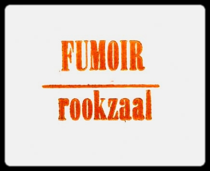

**Patacycliste org archives (by DK)**  *inclu.* [Laboratoires Patacyclistes](../01.dkorg-lp) 1992-1999 / [Pistologie](../02.dkorg-pist/) 1994-2017 / [Bureau du Port](../03.dkorg-bdp) 2000-2007 and [Fumoir](../04.dkorg-fum) 2008-2012        

  
<small>**FUMOIR / ROOKZAAL** Bruxelles _2008-2012_  variable happenings & open tribunes in DK atelier version II </small> 

**chronologi**

**2008**    
Fumoir 01 - [LL (L. Lambrecht) L’éveil à l’envers](../fum_01_2008.ll)    
Fumoir 02 - The 1.000.000 $ Pic-Nic  
Fumoir 03 - MRCVE - J.Permentier - V.Trabalza   

**2009**  
Fumoir 04 - [Odie Rynell CASH and a few Rastafari Abstracts](../fum_04_2009.odie_orc)    
Fumoir 05 - Oô Myth ho.. Michel Clerbois/ Simulacrum Piotr Osuskiewicz    

**2010**    
Fumoir 06 - Fabada  
Fumoir 07 - Frederic Tolmatcheff  
Fumoir 08 - Bowling DK  
Fumoir 09 - Mc Keta prjcts    

**2011**  
Fumoir 10 - [Tiroir Club (Guy Cardoso)](../fum_10_2011.tiroir_club)   
Fumoir 11 - Pori Box Kippis (Group Pori)  
Fumoir 12 - [Hinten sein vorne dasein (Stefan Bohnenberger)](../fum_11_2011.bohnenberger)  

**2012**  
Fumoir 13 - La Course / Pierre Cornut  

**(FIN)**

  
FUMOIR 01  LL L’éveil à l’envers 2008  
 

  
FUMOIR _typo / diapositive_

