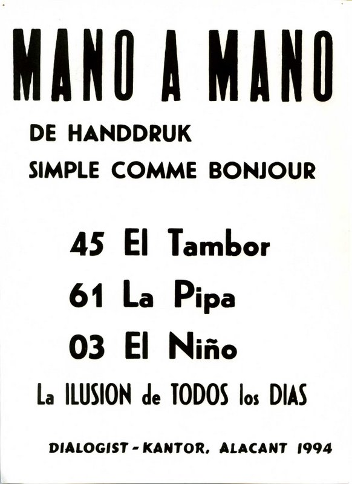

  
La ilusion de todos los dias 1994  

Affichette typo Alicante / basée sur les surnoms des 2 derniers chiffres de la loterie locale  

_The "art" of singing the numbers by giving them a nickname (Mote) is very old, and was born as the need to sell the coupons with the special grace of the blind sellers accompanied by their guides (sale of "couples", "pro-blind coupon", "the coupons", "the equals", "el chiquiti", etc.
Apparently it was born from the Charity Raffles of various associations of the blind and specifically in Alicante in 1903, spreading to Murcia, Cartagena, Almeria (Spanish Levante), Málaga, Melilla, Ceuta,..., to South America.
ALTHOUGH BASICALLY they maintain the same nomenclature, the use and customs of each place means that some "nicknames" vary in their extension and no two lists are the same.._  

[Liste complète des 'Motes'](https://elmuseodelcupon.blogspot.com/p/blog-page_30.html)

1994  
50 ex. Format A4  
 

