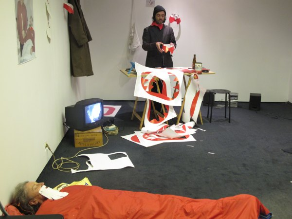

 
Secondroom Antwerpen IJZERLAAN 30 / 2060 ANTWERPEN 
17-24/11/2012

 
“col rouge” online invitation / no print /2012

beo-mainate (videobeo 1994-1995)/ collerette jaune /-> -> Bureau du Port( a poor sunday with..2001):COL d'OR p/'pauvres nous'- modèle-étalon,papier& cutter [a/ BEO d/cage ] & COL NOIR (Roubaix 2009) Chez Rita/TYPO (texte ?) //
++Fidel malade (2006) (Alicante Tag)--> F.I.D.E.L.(fake Idols dream electric landscapes)[loop]2007 --> COL ROUGE antwerpen secondroom 2012  

  
"F.I.D.E.L" travaux prep.  2007

**curator: Marc Van Tichel**

“Col Rouge” 2012  

“Col Rouge” 2012  

“Col Rouge” 2012

