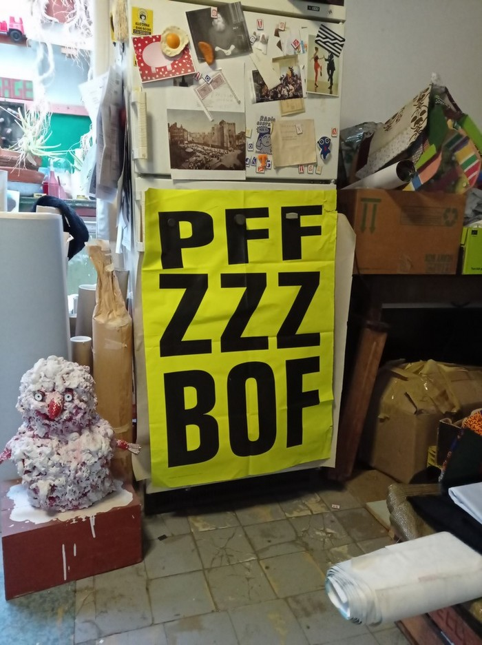
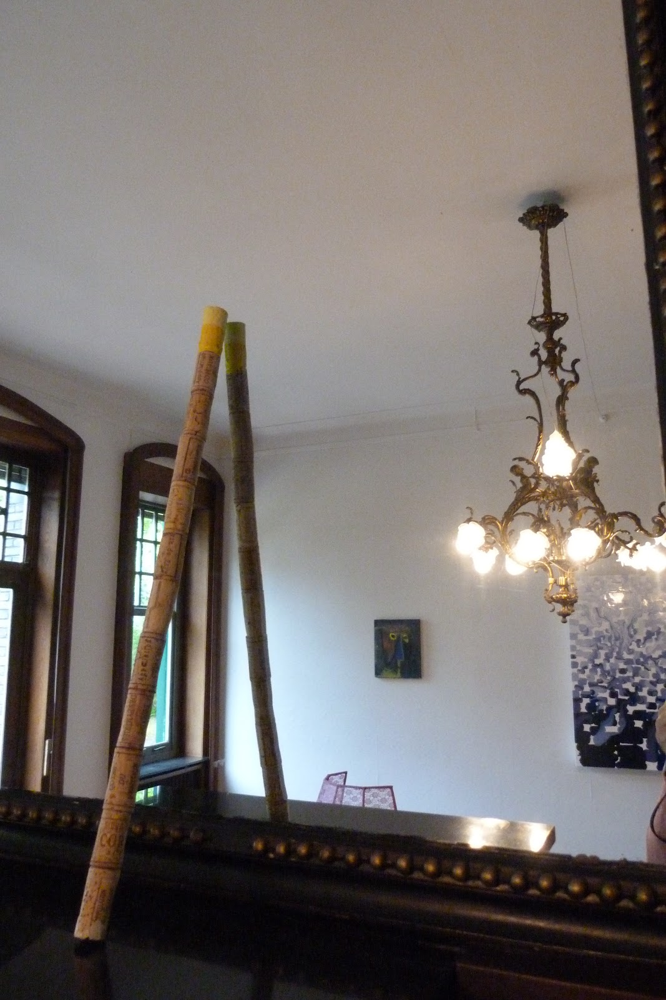

  
affiche "PFF ZZZ BOF" , 50 X 70 cm , 250 ex.  
  
# **SANS GÊNE**

Kunstenaars: Leo Copers, Marc De Blieck, Maria Degrève, Lieve D'hondt, Dialogist Kantor, Wannes Lecompte, Rik Moens, Lucie Renneboog, Peter Rogiers, Walter Swennen, Dominique Thirion

Locatie: **Villa De Olmen**

Curatoren: Maria Degrève en Lieve D'hondt

Vernissage: 16 september 2012 om 15u

Tentoonstelling: van 16 september tot 21 oktober, elke zaterdag en zondag van 11u tot 18u

Adres: Nieuwstraat 83, 9280 Wieze

Contact: 0478 40 59 80

  
Invitation Wieze 2012 

  
Hit Me stick / Dialogist-Kantor Wieze 2012 

press : https://waterschoenen.blogspot.com/2012/09/sans-gene-in-villa-de-olmen-te-wieze.html 

