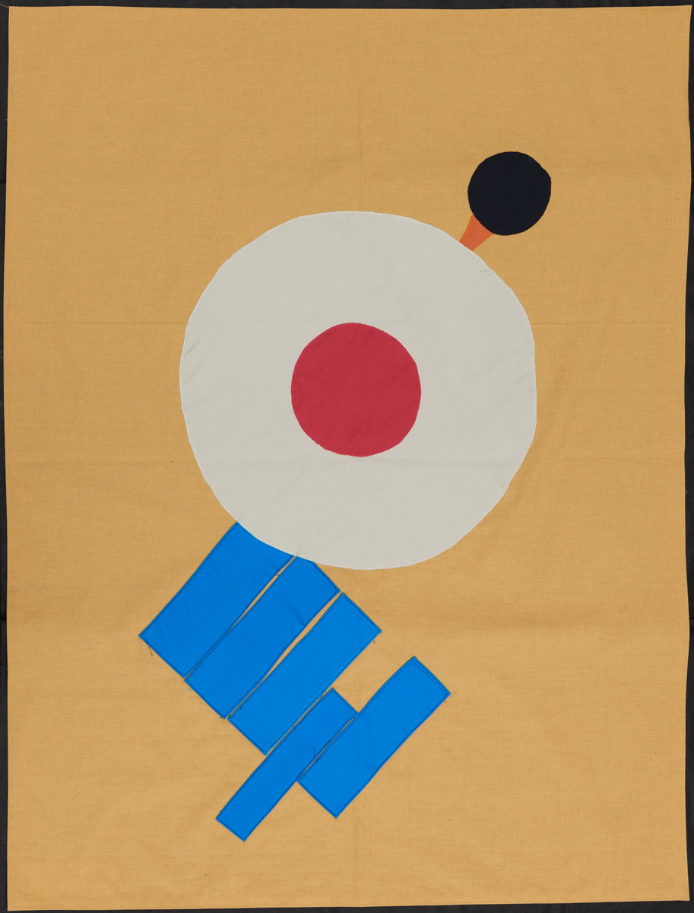
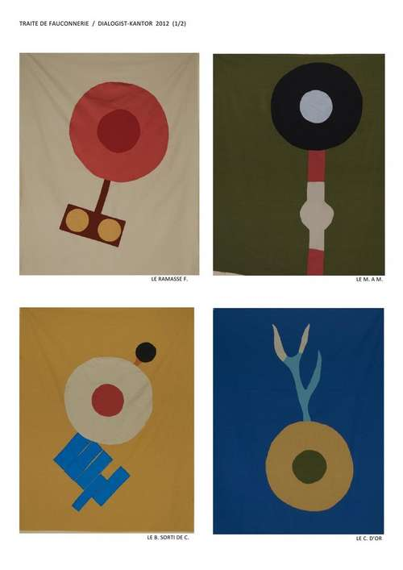

  
    
  
 Invitation Rossi Contemporary 2012   

**Traité de fauconnerie 2012**  
Rossi Contemporary Brussels

  
DK 'vidéo b.' /Traité de fauconnerie 2012

<strong>8 X coutures manuelles (env. 130 cm X 100 cm)</strong>

  
DK 'L'Art du Lendemain /Traité de fauconnerie 2012  

La deuxième manière de procéder est infiniment plus spectaculaire. 

Le f. commence par prendre de l'altitude au point de devenir quasiment invisible. De son poste d'observation aérien, il surveille les o. évoluant en contrebas. Lorsqu'il a repéré sa p., il se laisse tomber en repliant partiellement les a., augmente sa vitesse de chute par quelques b. puis ferme tout à fait les a. (..)

Quelques exemples:  

1. le m. à m.
2. le b. sorti de c. ou vidéo b.
3. les archives m.
4. le ramasse f.
5. les w. sticks
6. le c. d'or
7. l'art du l.
8. les chapeaux p.

D'une façon générale, la surprise est un élément déterminant de la réussite.

  
 Traité de fauconnerie 2012 2012   

  
 Traité de fauconnerie 2012 2012   

links:
[http://www.rossicontemporary.be](http://www.rossicontemporary.be) 

