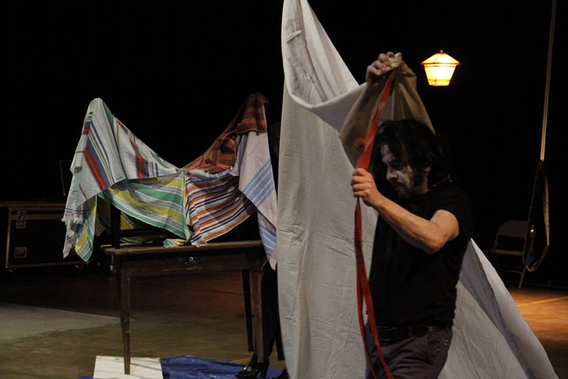

  

 Grand Paysage (restes) Académie de Saint-Gilles 2016 photo © Bernard De Keyser

'Grand paysage' festival PERFO! Duet/Duel Performance, live art and music event à Helsinki / 9 .10. 2015  Mad House, Kaasuntehtaankatu 1, Helsinki  
et 13 .10. 2015 à Telakka, Tullikamarinaukio 3, Tampere Finland 

+ reprises

1. GlogauAir  Berlin Buktapaktop (Sat 30th April 2016 / 4p.m. /GlogauAIRGlogauerstr. 16, 10999 Berlin Kreuzberg www.glogauair.net )  

1. Academie de Saint-Gilles 04 juin 2016 exposition IN/OUT rue Hôtel des Monnaies  
 
1. Ouverture de Blanche Endive de Gregoire Motte au Carré de Lille / 14 .11.2019 

  
DK @ blanche endive LILLE 2019 foto: julie vayssiere    

  
Academie de Saint-Gilles 04 juin 2016 

Dialogist-Kantor, Grand Paysage, Helsinki 2015

**Performance Festival Poster Tampere 2015**
  

