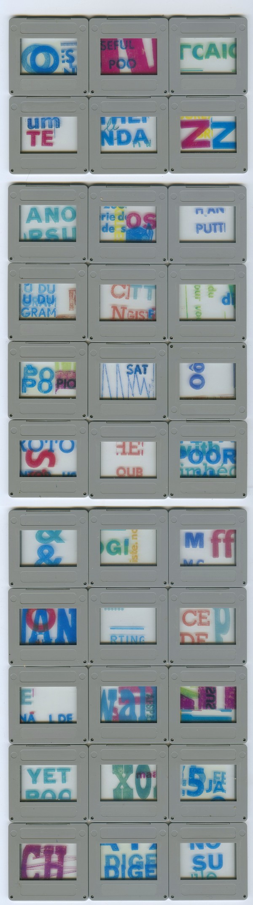

  
    
**PoorPoo 2015** 33ex. mixed tech. / Dia + peg-pince à linge  

Le multiple édité à 33 exemplaires a été présenté à <strong>Platform 102</strong> sous intivation de Odie Rynell Cash le 12/07/2015 et à <strong>(SIC)</strong> le 18/05/16 pour l'expo collective <strong>Le jeu de l'oie</strong> 
(curator: Yoann Van Parys)

platform 102 Contemporary Multiples and Editions 2015
<b>Contemporary Multiples and Editions</b>
Platform 102 / Brussels 
rue Antoine Dansaert 102
1000 Brussels

(SIC) Le jeu de l'oie 2016  

<strong>Le jeu de l'oie</strong>
(De 1 à 6 joueurs / 10 ans et +)

 Michel Goyon, Jacqueline Mesmaeker, Christophe Terlinden, Olivier Foulon, Lucia Bru, Vaast Colson, Leon Vranken, Freek Wambacq, Dialogist-Kantor, Sylvie Eyberg, Cyril Bihain, Pierre Lauwers, Fiona Mackay, Raphaël Van Lerberghe, Denicolai & Provoost, Pierre Gerard, Antoine Van Impe, Wobbe Micha, Pol Matthé, Reinaart Vanhoe, Cathérine Lommée, Peggy Franck, Joël Vermot 

Vernissage : mercredi <b>18 mai 2016</b> de 18h à 21h

(SIC)
Avenue Van Volxem, 54
1190, Bruxelles
0472/476003
www.sicsic.be
info@sicsic.be

