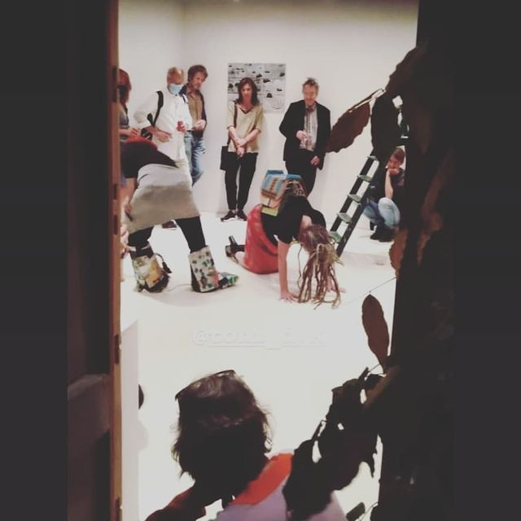

  
    
  
BEFORE THE DAY AFTER  

<!-- BEFORE THE DAY AFTER    -->
<small><b>Charlotte Beaudry, Julien Daffe, Dialogist-Kantor, Djos Janssens, Annick Nolle, Benyamin Perry, Olivier Stevenart </b></small>   

OPENING FRIDAY 18 /09 2020 - 19.00   
EXHIBITION 18/09 > 21/11 SAT & SUN - 15.00 > 18.00 OR BY APPOINTMENT   

 P37 GALLERY Rue Pierreuse 37     
B 4000 Liege     
djos.janssens@gmail.com T +32 475 421 660       
chapeau20100@gmail.com T +32 497 167 916      
   

  
 "petites selles d'appartement" DK 2020 

