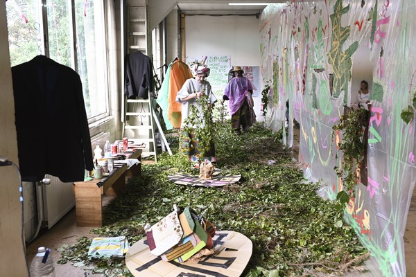

  

 

FESTIVAL TROUBLE #11 (07-11 / 07 /2021)  
[https://www.thor.be/fr/festivals/trouble-11](https://www.thor.be/fr/festivals/trouble-11)  
photos: Colin Delfosse  
costumes: Sofi Van Saltbommel  

  
“Admiral Absturz Garten” 2021

Isabelle Bats & Mathias Varenne (BE), Jean-Biche & Kimi Amen (BE/FR), Vincenzo Carta & David Zagari (IT/BE), Matty Davis & Ben Gould (US), Dialogist-Kantor (BE), Sebastian Dicenaire & Vincent Tholomé (BE), Audrey Ginestet & Benjamin Glibert (FR/BE), Adam York Gregory & Gillian Jane Lees (UK), Habitant.e.s des Images (BE), Tellervo Kalleinen & Oliver Kochta-Kalleinen (FI), Kubra Khademi & Daniel Pettrow (AF/US), Lenka Luptakova & Fanny Dupont (BE/FR) Pâle Mâle (FR), Lazara Rossel Albear & Sofia Kakouri (CU/GR/BE), Gaëtan Rusquet & Thiago Antunes (BE/BR), Raeda Saadeh (PS), Alexane Sanchez & Walter (BE), Sylvain Souklaye (FR/US) – Hilal Aydogdu, Martin Bonnaz, Lou Kanche & Camille Bleker, Barbara Salomé Felgenhauer, Aimé.e Rossi, Baptiste Saint-Pé (FRAGILE)  

curator: Antoine Pickels
 
  
photo: Isabelle Francis

 thanks to public contributors incl. Hilde Overbergh, Isabelle Francis, 
Marcus Bering, Carine Van Erps, Kristien Van den Houte, Guy Cardoso, Julie Martineau, Jean-François Paquay, Sofi van Saltbommel etc.  
this performance was dedicated to Sven Lager (1965-2021)

 
<!-- “Admiral Absturz Garten” 2021  -->

  
<!-- “Admiral Absturz Garten” 2021   -->

  
<!-- “Admiral Absturz Garten” 2021  -->

  
<!-- “Admiral Absturz Garten” 2021  -->

  
“Admiral Absturz Garten” 2021

