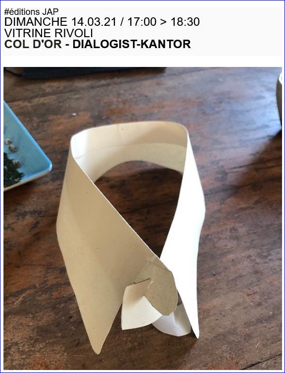
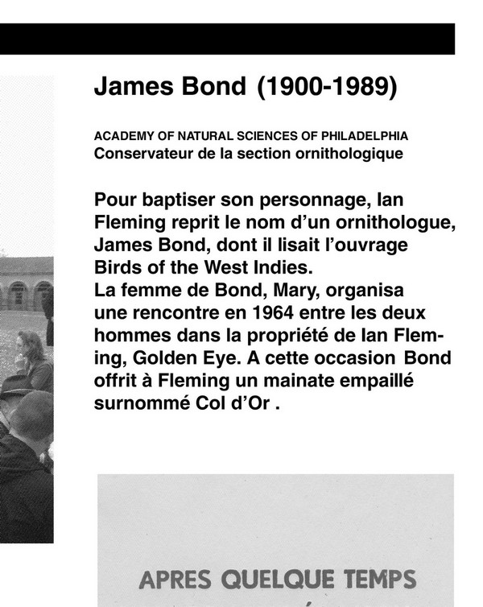

 

  
COL D'OR, découpe laser acier S235 peint, notice de montage dessinée à la main + cachet de signature. Edition numérotée et tirée à 25 exemplaires + 5 E.A.  

éditions JAP 

DIMANCHE 14.03.21 / 17:00 > 18:30   
VITRINE RIVOLI  
COL D'OR - DIALOGIST-KANTOR

JEUNESSE ET ARTS PLASTIQUES  
23 RUE RAVENSTEIN — 1000 BRUXELLES  
T 02 507 82 25 — INFO@JAP.BE   
[WWW.JAP.BE](https://WWW.JAP.BE)
        

  
 extrait affiche DK L'incendie du musee, l'Orangerie, Bastogne   

 Col d'Or / multiple 2021 ( private coll. D.R.)  

