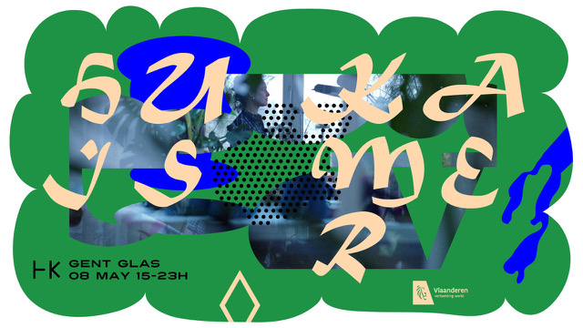

  

Online Event  
Saturday, May 8, 2021 at 3 PM UTC+02 – 10 PM UTC+02  
8 Mei verwelkomt Gent Glas een 20 tal kunstenaars in zijn huis, in haar kamer. Hoe anders gedragen we ons als we welkom zijn, en ons thuis voelen, als kunstenaar. Glasobjecten in aanmaak, een hele middag en avond lang stomen en gloeien bij oven. De ambacht van de transformatie in al haar sensualiteit.
Dans ontstaat, beeld vormt en geluid vindt plaats. Gent Glas wordt Huis Kamer en onder curatorschap van Ilse Van Roy opent het haar deuren voor makers, participanten.
Ilse Van Roy, Madeli Viljoen en Toni Geirlandt zullen elk materie en spanning opbouwen tot breekbaar object.
Sarah Corynen mobiliseert karton en tableaux en beeld en keramiek tot doorkijkluik voor oven, nieuwsgierigheid en hitte.
Lore Stessel, Ruben Martinez Orio, Eva Honings, Jeanne Colin en Veerle Van Rossem installeren percussie ritmes, video werk temidden van dans en textiel en vice versa danst en werkt en textielt het geheel. Sculptuur worden we, als observant.
Glenn Cox transformeert loods in licht en geluid, beiden projecterend in partikels en frequentie, vanuit destructie en breekbaarheid.
Marika Meoli, Anne Busscher en Pablo Hannon zien momenten van reactie op ruimte, energie en tijd. Improvisatie-interrupties in beeld, geluid, object en beweging.
Dialogist-Kantor laten Huis Kamer daveren door de honger en de lust, het maal en het ritueel van voedzame installatie.
Stef Lemmens, Ingeborg Govaart en Elke Cuppens zorgen voor de livestream in website en social media.
Louise Degraeve zorgt als fotograaf voor residu in beeld.
We danken John Moran en Gent Glas voor de hospitaliteit en huiselijkheid van deze industriële ruimte. Huis Kamer te volle uit.

[https://www.facebook.com/events/3463322380473326](https://www.facebook.com/events/3463322380473326)
        

