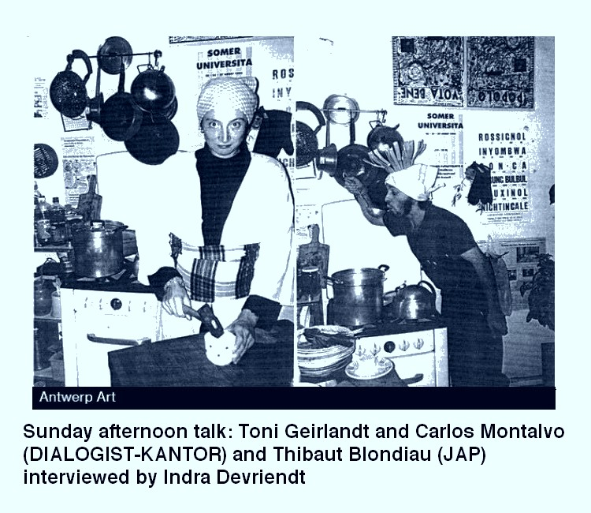

  

You are cordially invited to our Sunday afternoon talk on the 15th of December at 3 PM, inspired by “Erntedankfest”.

Starring: DIALOGIST-KANTOR / Toni Geirlandt and Carlos Montalvo
Jeunesse et Arts Plastiques: Thibaut Blondiau
Interviewed by Indra Devriendt (and you).  
LLS Paleis
Paleisstraat 140, 2018 Antwerp

+32 3 337 03 87
info@llspaleis.be
[llspaleis.be](http://llspaleis.be/expo/erntedankfest-in-collaboration-with-jap-jeunesse-et-arts-plastiques/)

https://antwerpart.be/agenda/erntedankfest-joyeuses-moissons  

Start: 3 PM
Language: English
Followed by Kaffee und Kuchen.

Everybody welcome!

As a part of the exhibition: Erntedankfest « Joyeuses moissons »

Presentation of editions, multiples and artist publications in collaboration with the Brussels-based organisation JAP (Jeunesse et Arts Plastiques).

With contributions by:

Meryem Bayram & Hans Demeulenaere
Pierre Bismuth
Claude Closky
Vaast Colson
Philippe De Gobert
David de Tscharner
Dialogist-Kantor
Peter Downsbrough
Sam Druant
Lise Duclaux
Michel François
Ana Jotta & Pierre Leguillon
Hamer Körmeling
John Körmeling
Arnaud Labelle-Rojoux
Adrien Lucca
Jacqueline Mesmaeker
Ria Pacquée
Manfred Pernice
Laure Prouvost
Stephanie Rizaj
Anne-Marie Schneider
Joëlle Tuerlinckx
Sietske Van Aerde
Martien van Mens
Ken Verhoeven
Oriol Vilanova
Elsa Werth
Yue Yuan

Exhibition: 17.11.2024 — 22.12.2024

Opening hours:
Thursday - Sunday from 2 - 6 PM
and by appointment
LLS Paleis
Paleisstraat 140, 2018 Antwerp

+32 3 337 03 87
info@llspaleis.be
llspaleis.be

