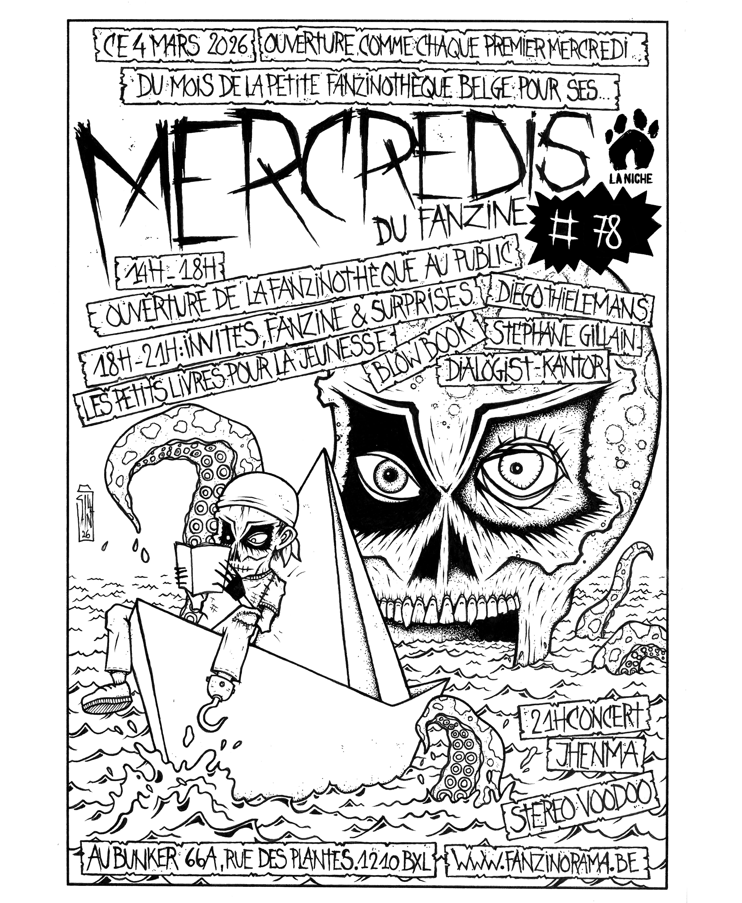

 

 
Mercredi du Fanzine #78  

4 mars 2026 apd 18h    
Au Bunker 66A rue des Plantes 1210 Bruxelles  

*** Stéphane Gillain, en route mousaillons !  
*** Blow Book, des petits lives pour les croisières mouvementées;  
*** Dialogist-Kantor, des marins sur le pont;  
*** Diego Thielemans, tout en couleur le fond sera bleu;  
*** Les petits livres pour la jeunesse, pour calmer la tempête !  
*** Manon, @awa bazart, en flibustière à la proue !

Concerts 

21H00 JHENMA   
22H00 STEREO VOODOO   

[Facebook Mercredi du Fanzine#78](https://www.facebook.com/events/26465992576332216/?acontext=%7B%22event_action_history%22%3A[%7B%22mechanism%22%3A%22attachment%22%2C%22surface%22%3A%22newsfeed%22%7D]%2C%22ref_notif_type%22%3Anull%7D)

