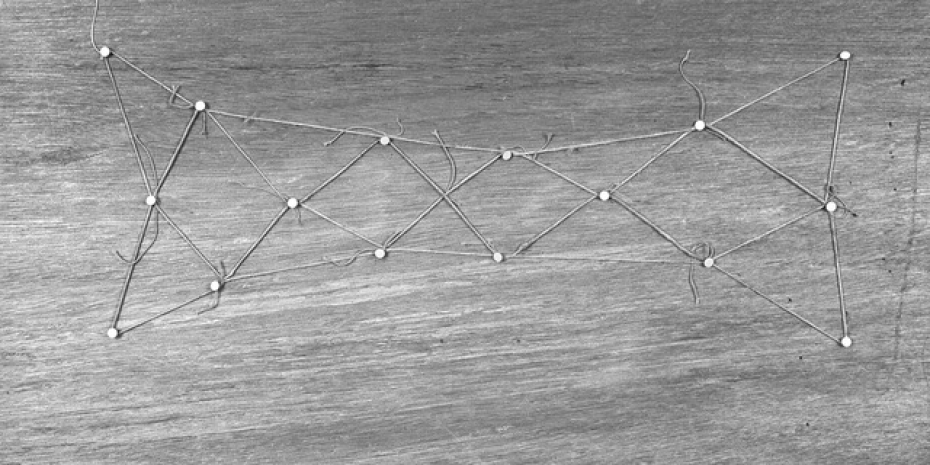

 

 

Figura  
07 March – 05 April 2026 

List of artists:Art & Language, Jean-Pierre Bertrand, Sabine Blanc, Dialogist-Kantor, Aurélie Gravelat, Raymond Hains, Isidore Isou, Joseph Kosuth, Antoine Laval, Dominique Rappez, Marc Rossignol, Eugène Savitzkaya, Francis Schmetz, Bernard Villers.  

[info Figura Cosmos Garage](https://www.garagecosmos.be/exhibition.php?id=58&lang=en)  

Heures d'ouverture  
Ouvert pendant les expositions, du vendredi au dimanche, de 13h à 18h.  
Nous sommes aussi ouverts sur rendez-vous. 
Pour plus d'informations, contactez 
info@garagecosmos.be 

Garage Cosmos  
Avenue des Sept Bonniers 43 1180 - Bruxelles Belgique

