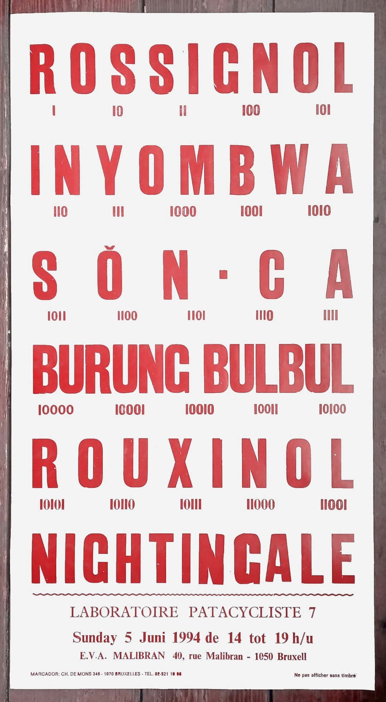
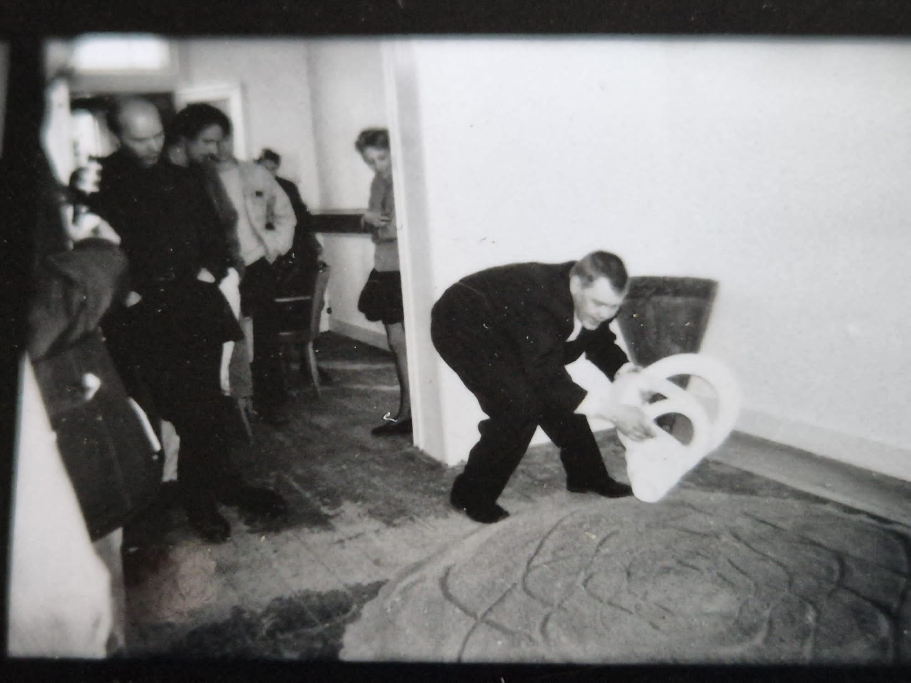
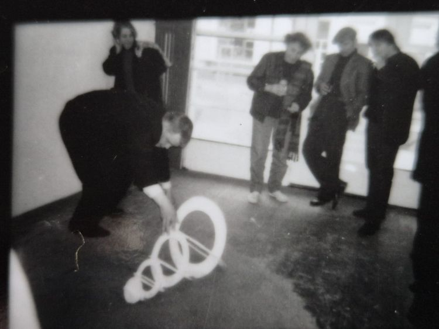
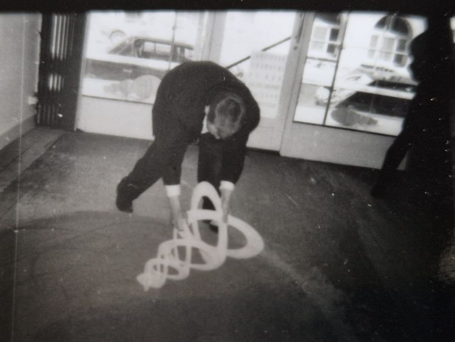

SECTION: **[Laboratoires Patacyclistes](../01.dkorg-lp)** (1992-1999) LP 07/25  

 
  

 
Typo 50ex 

  

Ouverture de E.V.A. Malibran 05/06/1994. 
 Installation de Marc Rossignol, activée à plusieurs reprises, avec différents modules cylindriques placés et roulés sur un cercle de sable tracé au sol d’un mètre de diamètre.

  
  
  
 LP07 E.V.A. Malibran (Bruxelles) / Rossignol 1994

